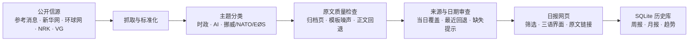

# NewsLens Daily

一个面向中文读者的多信源新闻追踪与来源审查工具。它从参考消息、新华社、环球网、NRK、VG 等公开媒体来源抓取新闻标题、发布时间和原文链接，筛选“中国国内时政 / 国际时政 / AI 产业”和“挪威 / NATO / EØS”相关内容，并生成一份可以直接点击跳转原文的网页日报。

**在线 Demo：** [NewsLens Daily](https://staaleli.github.io/NEWSPAPER-AI-finne-avis/)

项目页面支持主题筛选、中/挪/英界面切换，以及周报、月报和来源审查视图。

这个项目不是简单的新闻列表，而是把“抓取、筛选、解释、审查、展示”连成一条完整流水线：

```text
fetch -> classify -> enrich -> audit -> render -> persist
```



当前版本已经包含正文抓取、规则筛选、摘要解释、可信度提示、claim check、SQLite 历史保存和 GitHub Actions 定时运行配置。即使不接入大模型，也可以独立生成可读的日报；如果设置 `OPENAI_API_KEY`，可以启用 LLM 做二次摘要和判断。

## 这个项目解决什么问题

普通新闻流信息量很大，但真正需要的是更快判断：

- 今天有哪些中国国内时政、国际时政和 AI 产业新闻值得继续读；
- VG / NRK 上有哪些挪威、NATO、EØS、公共安全、经济与政治新闻值得跟踪；
- 每条新闻来自哪里，能不能跳回原文核查；
- 标题背后的大概内容是什么，而不是只看到媒体频道名；
- 哪些内容更像企业宣传、观点评论或缺少交叉验证；
- 哪些来源当天抓取失败、日期不匹配或无法证明完整覆盖。

项目只保存标题、来源、时间、短摘要、筛选原因和原文链接，不保存新闻全文。

## 当前信源

- 参考消息：中国、国际、科技应用、产经、观点
- 新华网：时政、科技频道页
- 环球网：国际、科技频道页
- NRK：最新新闻 RSS
- VG：最新新闻 RSS

## 项目目录

- `ai_builder_digest/`：核心程序代码，包含抓取、分类、摘要增强、网页渲染、SQLite 保存和可选 LLM 调用。
- `tests/`：离线测试，覆盖关键词筛选、日期窗口、缓存、解析回退和 SQLite 写入。
- `.github/workflows/`：GitHub Actions 自动生成日报和发布 Pages 的配置。
- `docs/`：项目说明文档，解释目录结构、信源审查机制和筛选逻辑。
- `site/`：本地生成的网页日报，不建议作为源码上传。
- `data/`：本地生成的数据、缓存和 SQLite 历史库，不建议作为源码上传。

更详细的说明见：

- [`docs/project-structure.md`](docs/project-structure.md)
- [`docs/sources-and-audit.md`](docs/sources-and-audit.md)
- [`docs/filtering-logic.md`](docs/filtering-logic.md)
- [`docs/change-notes.md`](docs/change-notes.md)

## 运行方式

在项目根目录先安装一次：

```powershell
pip install -e .
```

然后执行：

```powershell
news-digest
```

生成指定日期的日报：

```powershell
news-digest --target-date 2026-06-10
```

强制重新抓取来源和正文：

```powershell
news-digest --target-date 2026-06-10 --no-cache
```

生成结果：

- `site/index.html`：可以直接打开的网页日报；
- `data/digest.json`：结构化结果，方便后续接数据库或 LLM 摘要；
- `data/audit.json`：来源与完整性审查结果；
- `data/cache.json`：抓取缓存，避免短时间内重复请求同一来源；
- `data/article_cache.json`：正文抓取缓存，仅本地使用，不建议上传；
- `data/digest.sqlite`：历史数据库，保存每天的结果和来源审查。

启用 LLM 二次摘要和判断：

```powershell
set OPENAI_API_KEY=your_api_key_here
news-digest --target-date 2026-06-10 --use-llm
```

Mac / Linux：

```bash
export OPENAI_API_KEY=your_api_key_here
news-digest --target-date 2026-06-10 --use-llm
```

没有 API key 时不要加 `--use-llm`，程序会使用本地规则生成摘要和判断。

## 筛选逻辑

第一版使用可解释关键词规则，便于调试和复现：

- AI 相关：人工智能、AI、大模型、生成式、算法、算力、智能体、芯片、数据中心等；
- 时政 / 政策相关：政策、监管、治理、国家、中央、法规、标准、安全、产业、国际、中美、欧盟等；
- 挪威相关：Norge、NATO、EØS、regjering、Stortinget、forsvar、sikkerhet、Norges Bank、Høyre、nødvarsel 等；
- 每条结果显示命中的关键词和相关性分数；
- 默认只保留目标日期当天的已知日期文章；
- 无法可靠识别日期的 HTML 条目会保留，但在审查区提示“无法证明当天完整性”；
- 筛选后继续抓取原文正文，生成摘要、重要性说明、来源可信度提示和 claim check；
- VG / NRK 新闻保留原文标题，同时生成中文解释；
- 二次判断会把条目标成 `keep` 或 `review`，`review` 表示需要人工复核。

## 为什么结果值得核查

公开 RSS 和网页无法保证“绝对不漏”。本项目不会假装结果完整，而是把风险明确暴露出来：

- 每个来源记录抓取状态、抓取数量、当天数量、可识别日期数量、最新发布时间和入选数量；
- 来源失败会在网页和 `data/audit.json` 里标红；
- RSS 时间会转换到来源所在地时区后再判断是否属于目标日期；
- HTML 频道如果没有可靠日期，会标注“无法证明当天完整性”；
- 原文提取会优先读取正文容器，过滤重复模板文字；无法得到可信正文时会回退到页面摘要或标题，并在审查区计数；
- 已识别为“过期归档”的新华网页面不会进入日报；
- 中国侧重点检查国内时政、国际时政、AI 产业三个必要栏目；
- 挪威侧重点检查 VG / NRK 是否成功抓取，以及筛出的挪威 / NATO / EØS 条目数量。

这套审查机制不能保证新闻“绝对不漏”，但可以让来源失败、日期不匹配、频道抓不到内容这些风险变得可见。

## SQLite 历史库

程序会把每天的结果写入 `data/digest.sqlite`：

- `digest_items`：每天入选的新闻、摘要、判断、claim check；
- `source_audits`：每天各来源的抓取状态和覆盖审查。

后续可以用它做趋势分析，例如“过去 30 天 AI 监管新闻数量变化”或“挪威安全议题出现频率”。

## 自动运行和部署

仓库包含 `.github/workflows/daily-digest.yml`。上传到 GitHub 后，可以在仓库 Settings 里开启 GitHub Pages，Actions 会约每 5 小时重新抓取当天信源并发布 `site/index.html`。

自动任务使用北京时间计算 `--target-date`，避免 GitHub Actions 默认 UTC 时间导致“今天”的日期错位。因为 24 小时不能被 5 整除，当前计划大约会在北京时间 08:17、13:17、18:17、23:17、次日 04:17 运行；也可以在 GitHub Actions 页面手动点击运行。

如果只是本地使用，直接打开 `site/index.html` 即可。

## 局限与下一步

这不是“保证不漏”的新闻数据库。公开频道、RSS 和网页结构都会变化；参考消息正文并不总是完整，HTML 频道也可能无法提供逐条发布日期。三语界面在未配置 `OPENAI_API_KEY` 时会回退展示已有文本，不能把回退文本视为正式翻译。

接下来的验证计划是连续运行至少两周，并基于 SQLite 历史记录复盘：信源实际覆盖率、正文提取回退率、错误链接率、各主题入选比例和人工发现的问题。模板见 [`docs/project-report-template.md`](docs/project-report-template.md)。

后续优先级：

- 连续两周验证信源日期、正文质量和自动发布稳定性；
- 增加更多挪威官方来源，例如 regjeringen.no、stortinget.no、forsvaret.no；
- 为翻译增加成功率和回退状态显示，避免把中文回退误认为英文或挪威语译文；
- 用人工抽样结果校准关键词筛选，降低漏报和误报；
- 将稳定版本发布为 GitHub `v1.0` Release，并补充真实页面截图或短 GIF。
